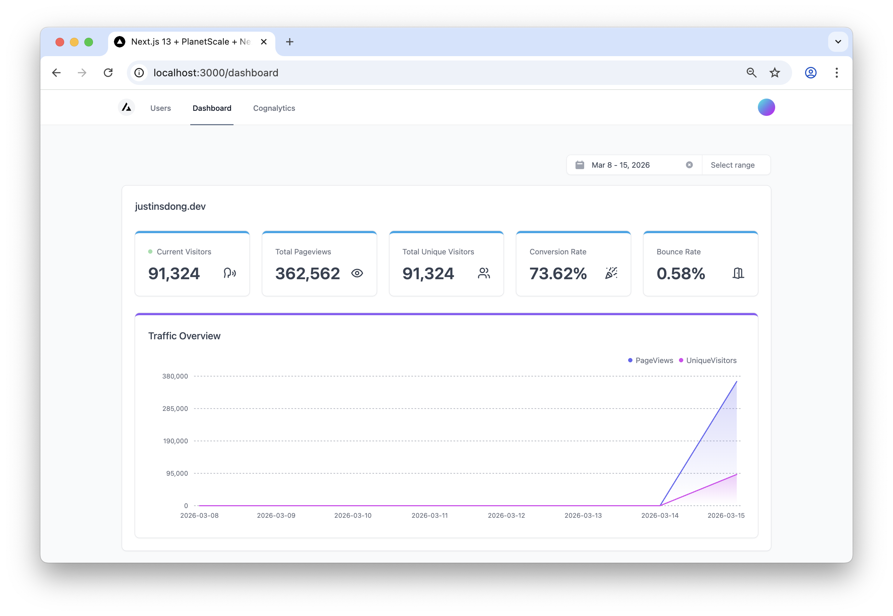
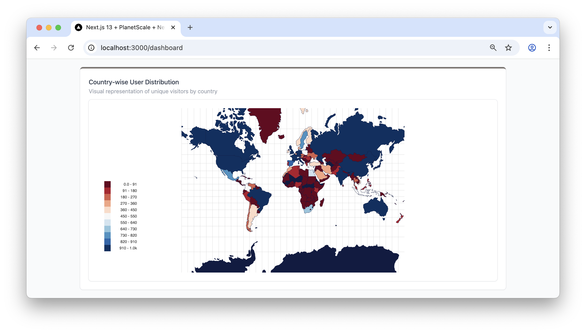
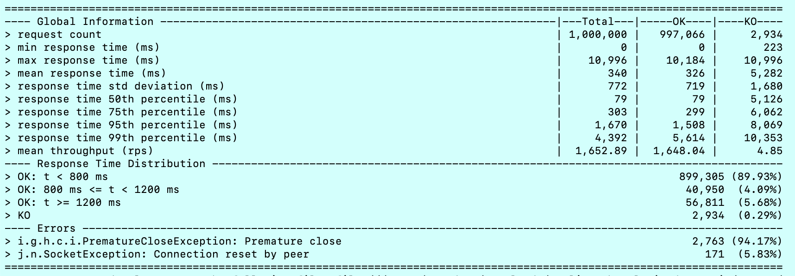
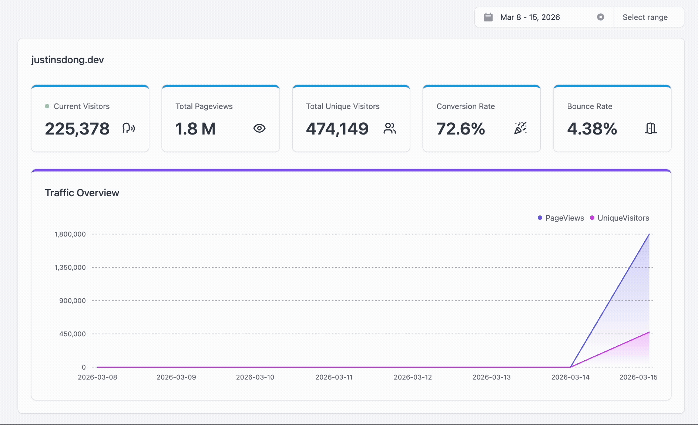
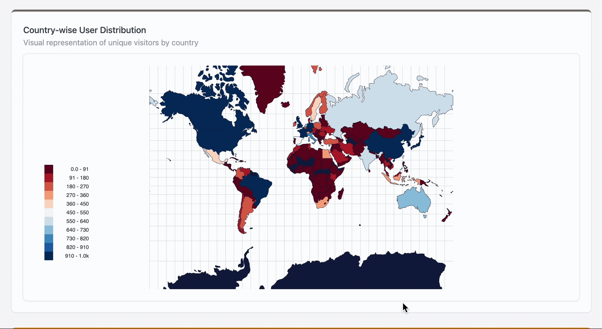
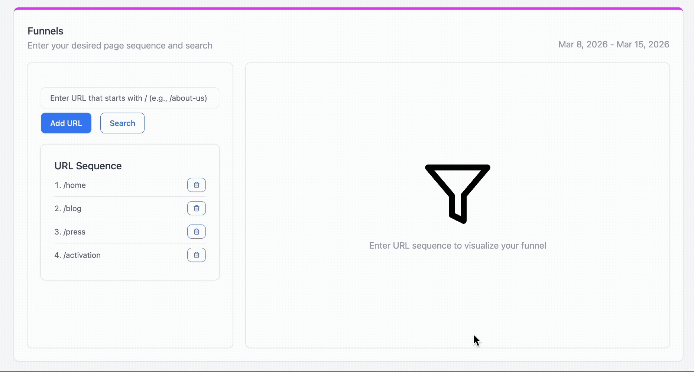

## 🔍  Roving Analytics

<p align="center">
  
</p>
<p align="center">
  
</p>

### Go powered analytics platform
Roving Analytics is a lightweight web analytics platform that I built for my personal website. It provides non-trivial analytics capabilities while remaining simple to deploy and operate.

The backend is written in Go, with a Next.js-powered frontend for visualization and reporting.

### Motivation

My background is primarily in Scala backend engineering, where systems often embrace powerful and expressive abstractions such as advanced type systems and functional programming patterns.

While I enjoy Scala's expressiveness, I wanted to experiment with a very different philosophy.

### Project History

I started this project about two years ago. Development was somewhat on-and-off due to work commitments, but I eventually pushed it across the finish line and now use it to power analytics for my own website.

The goal was not just to build a toy tracker, but to implement real analytics functionality similar to what production platforms provide.

### Feature
- Real-time analytics report (Current Visitor, Country, Referrers, Devices etc)
- Funnel Analytics
- Common User Journey(What users do most on your website)
- Conversion Rate
- Bounce Rate


### Performance Testing

I recently performed a performance test using [Gatling](https://gatling.io/).

The test scenario ramped up:

- 250,000 simulated users

- Over 10 minutes

- Each user sending 4 requests

- This resulted in roughly 1 million total requests.

A single instance of the Go service sustained the load with approximately ~1600 requests per second which honestly impressed me.

I suspect the backend could handle even higher throughput. During testing I observed a number of "connection reset by peer" errors locally, which suggests the bottleneck might be elsewhere.

Further investigation is ongoing, but the results so far suggest the Go service itself still has headroom.

<p align="center">
  
</p>

## Demo

### Real-time reporting(during load test)
<p align="center">
</img>
</p>

### Country Distribution(during load test)
<p align="center">
</img>
</p>

### Funnel Metrics(during load test)
<p align="center">
</img>
</p>

## Development

1. **Prerequisite**
   - Go 1.24
   - npm
   - [Clickhouse](https://clickhouse.com/docs/install/quick-install-curl) - for local development, the quickest way to get set up is to run an install script using curl. The script will determine a suitable binary for your OS.
2. **Database Setup**
   - Start Clickhouse locally (`./clickhouse server`)
   - Connect to Clickhouse instance (`./clickhouse client`)
   - Create DB and table from the script in `001_initial_setup.sql`
3. **Prepare env variables**
   - The `data` folder includes pre-downloaded files for IP lookup(From MaxMind) and a referrer spam list text(maintained by community - source is mentioned in codebase comment)
   - These files are updated periodically so feel free to download and update them for local dev. If you deploy to production, you can mount these files in a volume and provide them.
   - Run 
     ```
     export GEOLITE2_MMDB_FILE_PATH="${pwd}/data/GeoLite2-City.mmdb"
     export REFERRER_SPAM_FILE_PATH=“${pwd}/data/referrer_spam_list.txt”
     export ROVING_JOURNEY_KEY="12345678901234567890123456789012"
     ``` 
     The journey key is a 32 bytes key used to mask the journey id for further anonymity. `12345678901234567890123456789012` is a dummy string for local dev. Set up the key in a vault or expose it via env for proudction.
4. **Build and run the Go service**
   ```
   go build -o roving-service main.go
   ./roving-service
   ```
5. **Generate test data**
   - Before you start, make sure to insert a mapping of your `hostname` to a `siteId` in the clickhouse `hostname_to_site_id` table since we'll be using `siteId` for queries in the FE
   - Go to Gatling to download community version for `Scala with sbt` (Yes, I use Scala for load test)
   - Copy the `TenMillionCommonJourneySimulation` into the `it/scala/example` folder. (Yes, Gatling does code-based load testing). Feel free to modify the test by defining the number of users for X period of time.(e.g. `rampUsers(100000) during (10 minute))`)
   - Run the test in the root Gatling test folder you downloaded by `sbt 'GatlingIt/testOnly roving.TenMillionCommonJourneySimulation'`
   - Now your Go service should start receiving and injecting events to Clickhouse
6. **Access the dashboard**
   - Navigate to `roving_frontend` and run
     ```
     npm install
     npm run dev
     ```
   - (Notice, in `env.local`, `ROVING_BACKEND_URL` has a default `localhost:80` so you do not have to modify it if you're running on your local machine. However, you do want to give `NEXT_PUBLIC_CONVERSION_PAGE` a meaningful value to accomodate your need. Right now, it has a dummy `/test` value)
   - Now the dashboard should be available at `localhost:3000`


## Deploy to Production
To use Roving Analytics on your own website, you can deploy the Go backend service and connect it to the dashboard.

One simple setup is to expose the Go service through a subdomain in your DNS provider. For example, Cloudflare can route a subdomain to your actual hosting provider (such as Railway or another cloud platform).

Example architecture:

```
your-site.com
    │
    ├── embeds analytics beacon JS
    │
analytics.your-site.com
    │
    └── Go analytics backend (hosted on Railway / cloud provider)
```

When running the dashboard locally, configure the backend URL: 
```
ROVING_BACKEND_URL=https://analytics.yourdomain.com
```

Same for `NEXT_PUBLIC_CONVERSION_PAGE` if you need a different value than the default dummy `/test`.

_You can create a `.env.production` to override the local values in `.env.local` if you want to deploy the dashboard to prod. Use `npm run build` and `npm run start` for production._

The dashboard will then query your Go backend and display analytics metrics for your site. I haven't  implemented authentication for accessing the Go service(it's still WIP) but this setup is simple and straightforward to view your own site's analytics metrics.